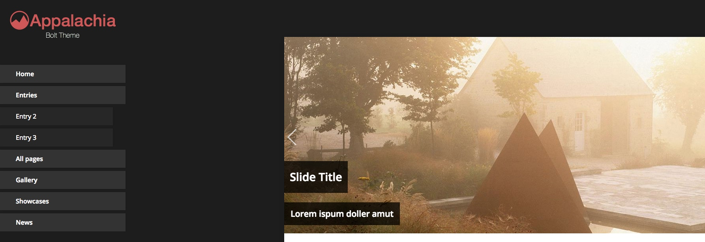

## Appalachia Bolt Theme

[View Demo Here](http://fluice.com/appalachia/)

### Configuration

The config.yml file contains a few properties that can be edited to configure the theme

- `showSidebarRecent` Show recent entries for each content type in the sidebar
- `showSidebarAbout` Show an about section in the sidebar

### Sample content types

Sample content types are contained in te sample_contentypes directory. A template is included with the theme for use in conjunction with the content type.
To install simple copy the contents of the file and paste them into the `app/config/contenttypes.yml` file.